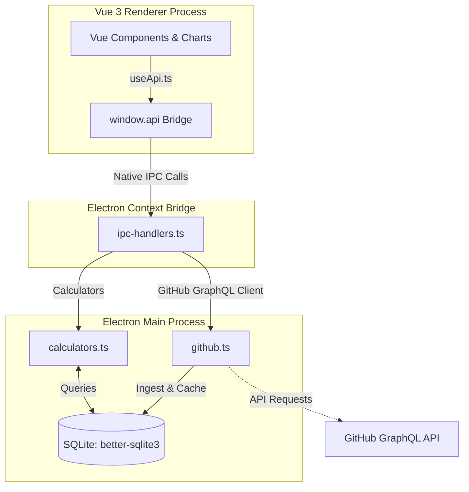

# ARCHITECTURE.md – Sprint Dashboard Application

## Overview
The Sprint Dashboard is a local desktop application that provides agile metrics for GitHub Projects.  
It replaces the single‑file HTML prototype with a three-tier architecture running entirely locally on the developer's machine as a cross-platform desktop app.

---

## Tech Stack

| Layer | Technology |
|---|---|
| **Shell & Runtime** | Electron (Main & Renderer process architecture), TypeScript |
| **Frontend** | Vue 3 (Composition API + `<script setup>`), Vite, Chart.js (`vue-chartjs`), TypeScript |
| **IPC Bridge** | Electron `contextBridge` + `ipcMain`/`ipcRenderer` (Native Node communication) |
| **Database** | SQLite (via `better-sqlite3` native Node.js driver) |
| **Packaging** | `electron-builder` (AppImage and tar.gz for Linux, portable exe for Windows) |

---

## System Components



### 1. Backend (Electron Main Process)
- **Purpose**: Runs native Node.js APIs to secure the GitHub token, query the GitHub GraphQL API, write to SQLite database, execute business logic metrics, and register IPC handlers.
- **Key Responsibilities**:
  - **Data Ingestion**: A manually triggered job pulls project items, transitions, and field values using the GitHub GraphQL API, caching them in the local database.
  - **Metric Calculations**: Custom TS calculators (`calculators.ts`) process historical data, status changes, clamping rules, and date boundaries to compute Burndown, Velocity, Cycle Time, Carryover, and Timesheets.
  - **Database Migrations**: Applies migration files (`migrations/*.sql`) automatically at startup relative to the application's runtime directory.
  - **Path Resolving**: Resolves database storage (`userData` directory) and local resources safely using `__dirname` to ensure it runs correctly when compiled or packaged as an ASAR file.

### 2. Context Bridge (`preload.ts`)
- Exposes a safe, restricted API to the frontend renderer process under `window.api`.
- Isolates Node.js execution capabilities from the Vue 3 frontend for security best practices.

### 3. Frontend (Vue 3 Renderer Process)
- **Purpose**: Modern, responsive UI displaying charts and tables.
- **Key Responsibilities**:
  - **Views & Routing**: Multi-tab layout (Burndown, Velocity, Overview, Commitment, Time Analysis, Quality, Scorecard, Team, Timesheet) managed via Vue Router.
  - **Global State**: Synchronizes projects across views and configs via shared composables (`useProjects`).
  - **State Filtering**: Integrates unified selector controls (`TimeSelector.vue`) to query and filter metrics either by Sprint or by Custom Date Ranges.

### 4. Database (SQLite)
- **Location**: Stored locally in the Electron's OS-specific user data directory as `sprint-dashboard.db`.
- **Database Schema**:
  - `projects` — Tracks projects, names, GitHub IDs, mapping configurations, token overrides, and "Done" status values.
  - `sprints` — Stores sprint durations, titles, start dates, and foreign key relations.
  - `items` — Stores issues/PRs, type, effort (estimated hours), actual hours worked, carryover status, and dates.
  - `config` — Holds global config properties.
  - `_migrations` — Logs applied database schema updates.

---

## Data Flow

1. **Ingestion & Caching**:
   - The user triggers a "Refresh" in the frontend.
   - The frontend requests a refresh via `window.api.refreshData()`.
   - The main process fetches items and status change timelines from GitHub, parses data, and writes the cache to the SQLite database.
2. **Metric Retrieval**:
   - The frontend calls `window.api.getBurndown(...)` or other metrics.
   - The main process queries SQLite, processes boundaries (clamping actual hours spent in the "In Progress" status, evaluating carryover, etc.), and returns the JSON payload back to the renderer process.
3. **UI Rendering**:
   - The Vue components convert the JSON payload into Chart.js datasets and tabular rows.

---

## Local Development & Packaging

### 1. Running in Development
Start concurrently the Vite frontend, compile typescript, and open the Electron shell:
```bash
npm run electron:dev
```

### 2. Running Backend Tests
Execute local unit tests using Vitest (rebuilds the native SQLite driver for the system Node.js version if needed):
```bash
# Rebuild native modules for system Node.js
npm rebuild better-sqlite3 --prefix backend

# Run the test suite
npm run test --prefix backend -- --run src/
```

### 3. Packaging Standalone Desktop Executables
Compile resources and package targets for Linux (AppImage, tar.gz) and Windows (Portable EXE):
```bash
# Rebuild better-sqlite3 for the Electron target runtime ABI version
npm run rebuild:electron

# Compile frontend + backend assets and compile binaries
npm run package -- --win --linux
```
Packaged binaries will be located under the `dist/` directory.
